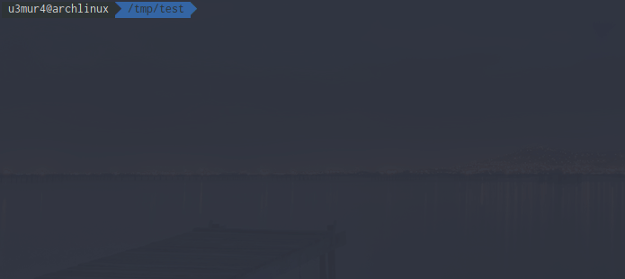

# megadl

Golang library to download public **files** from [mega](https://mega.nz).

## Example
```go
import "github.com/u3mur4/megadl"

reader, info, err := megadl.Download(url)
defer reader.Close()

// dump it to stdout
io.Copy(os.Stdout, reader)
```

See more complex example in the [example](/example) directory.

